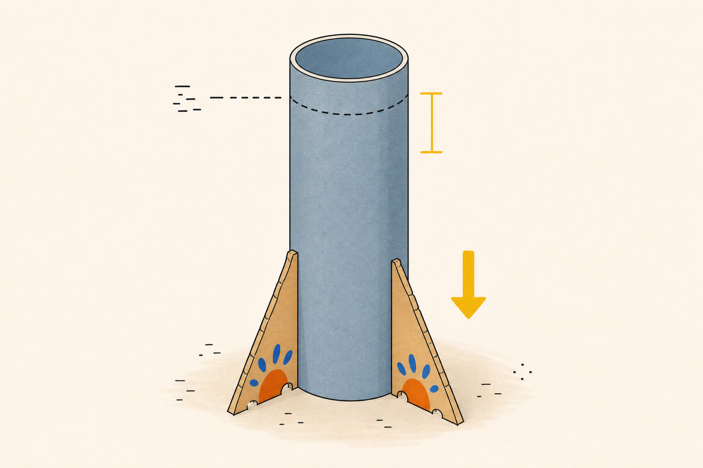
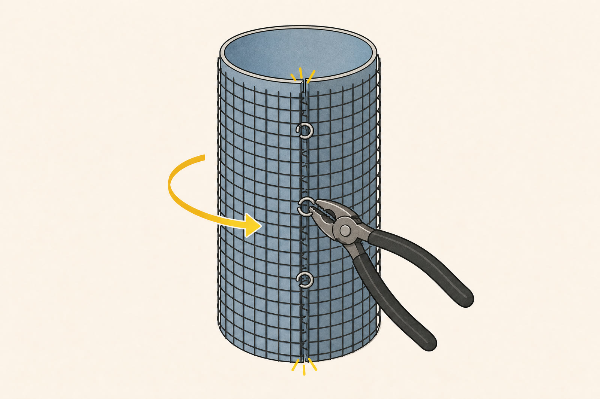
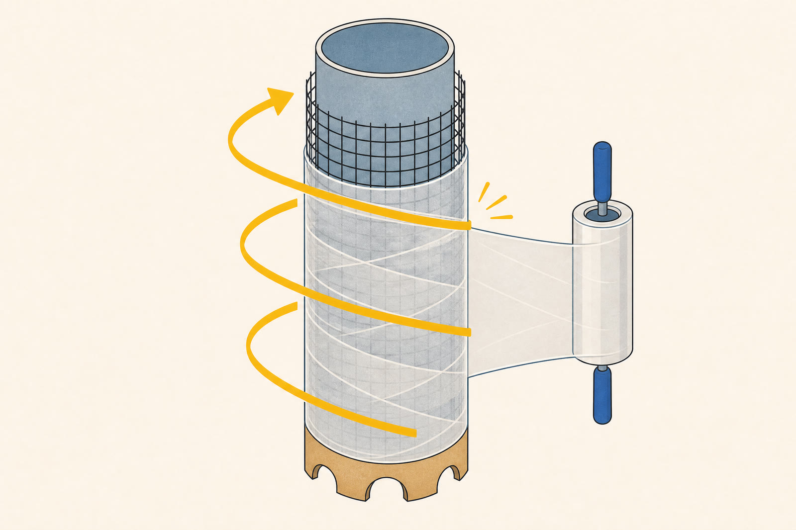
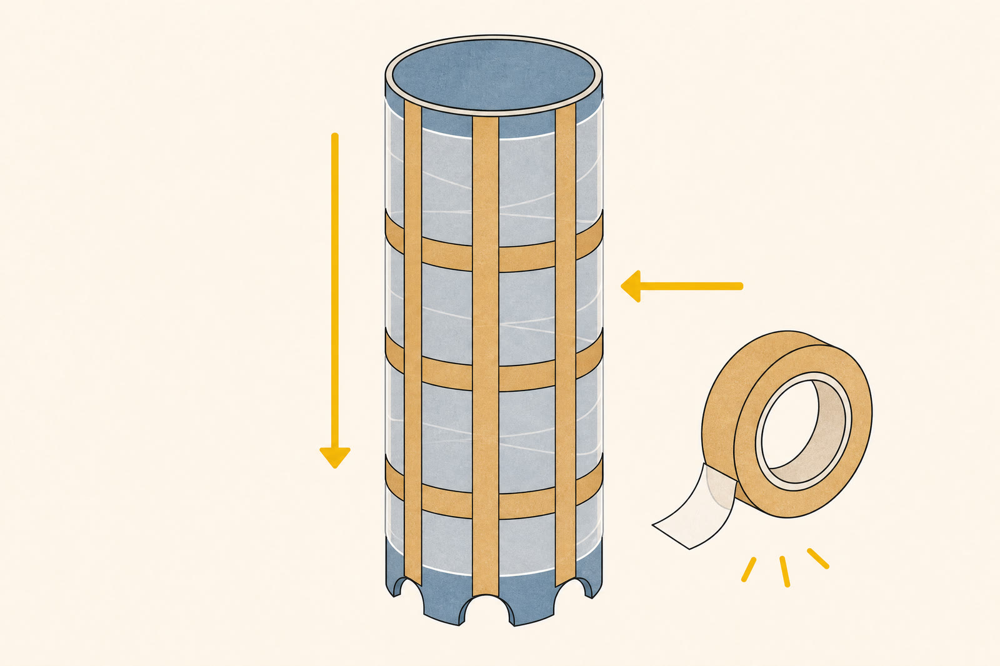
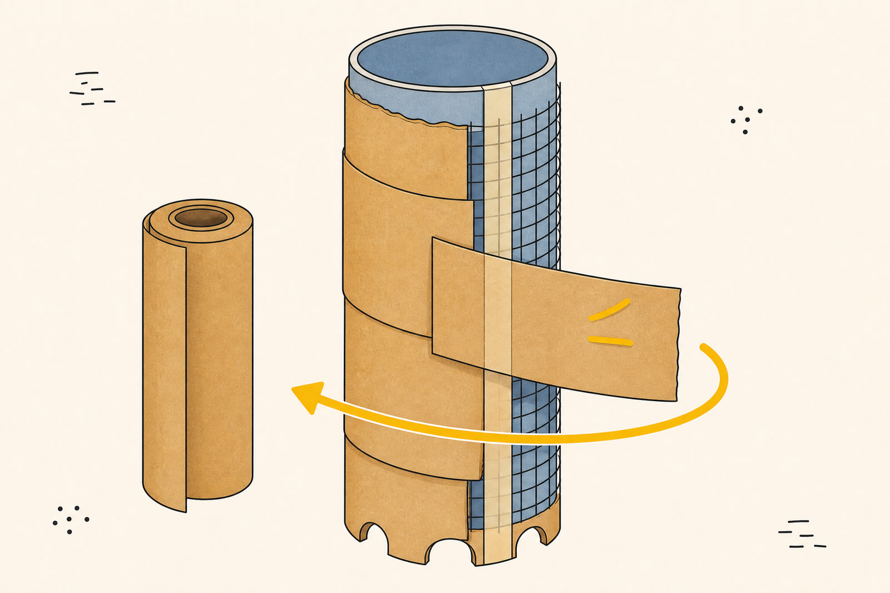
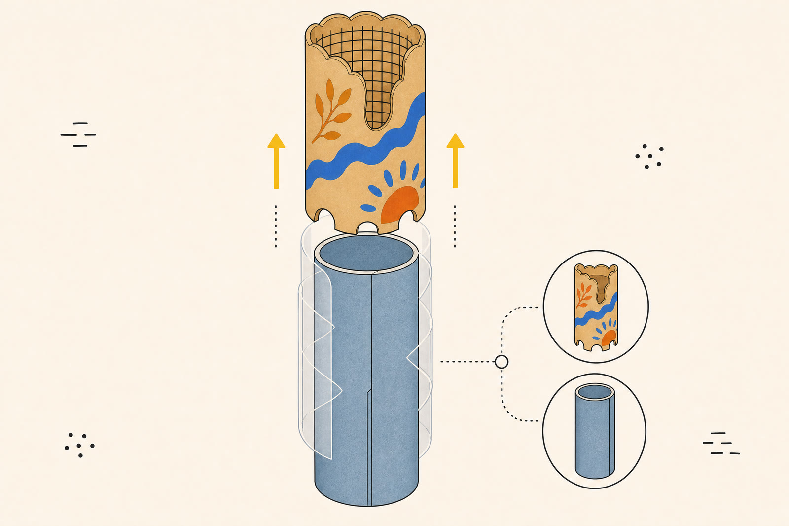

[Home](../Home.md) / [Columns](../Columns.md) / Assembly Instructions <!-- wikidown:breadcrumb -->

# Assembly Instructions
An illustrated, step-by-step build for the [Columns](../Columns.md), using the materials listed in the [Bill of Materials](Bill of Materials.md).

## Before you start

Confirm the **finished Sonotube diameter and height** before cutting any wire or paper. This guide shows the removable-shell approach: the stretch-wrap layer lets the finished paper, tape, and wire shell slide off the Sonotube after the paint has dried. If the tube will remain as a permanent core, simply skip the final release step.

| Build order | What you add | Why it matters |
| --- | --- | --- |
| 1 | Sonotube form | Establishes the finished height and round shape. |
| 2 | Wire mesh | Gives the shell rigidity and a textured structure. |
| 3 | Stretch wrap | Smooths the mesh and provides a release layer. |
| 4 | Carpet tape | Creates an adhesive grid for the paper skin. |
| 5 | Kraft paper | Becomes the paintable outer shell. |
| 6 | Paint | Makes the finished column your own. |

1<h2>Prep the form</h2>

<figure class="build-figure">
  
  <figcaption>Set the height first, then stabilize the tube before adding any layers.</figcaption>
</figure>

Cut the Sonotube to its finished height, stand it upright, and brace it so it cannot tip while you work.

- Cut the Sonotube to the finished column height.
- Stand it upright and brace it so it can't tip while you work.

2<h2>Wrap the wire layer</h2>

<figure class="build-figure">
  
  <figcaption>Overlap the seam, then use low-profile hog rings to hold the mesh flat at the seam and edges.</figcaption>
</figure>

Wrap hardware cloth around the form, overlap the seam, and crimp it closed with hog rings.

- Unroll the hardware cloth and wrap it around the Sonotube, overlapping the seam by a couple inches.
- Cinch the seam and the top/bottom edges with hog rings through the mesh, crimped shut with the hog ring pliers. They sit flatter than zip ties, so they do not bump through the layers on top.
- This layer gives the column its rigidity and a rough surface texture to build on.

3<h2>Add stretch wrap</h2>

<figure class="build-figure">
  
  <figcaption>Work upward in overlapping bands. The film smooths the mesh and keeps the finished shell from sticking to the form.</figcaption>
</figure>

Wrap the stretch film tightly from bottom to top, keeping each overlapping band smooth and taut.

- Wrap the stretch film tightly around the wire, working bottom to top in overlapping bands so it stays taut and smooths over the mesh bumps.
- This layer also acts as a release film between the Sonotube form and the paper shell. Do not skip it if you intend to slide the finished shell off the tube.

4<h2>Make a tape grid</h2>

<figure class="build-figure">
  
  <figcaption>A vertical-and-horizontal tape grid gives every paper strip enough adhesive support.</figcaption>
</figure>

Apply vertical tape strips first, then add horizontal bands to create a full adhesive grid.

- Run strips of double-sided carpet tape over the stretch wrap—vertically first (top to bottom), then a horizontal band every foot or so—to build an adhesive grid the paper will stick to.
- Leave the backing on until just before you press paper over each strip.

5<h2>Build the paper skin</h2>

<figure class="build-figure">
  
  <figcaption>Overlap the paper strips, cross the tape grid, and smooth the surface as you go.</figcaption>
</figure>

Apply overlapping kraft-paper strips one section at a time, pressing every strip firmly across at least one tape line.

- Tear or cut the butcher paper into workable strips.
- Peel the tape backing a section at a time and press the paper on, overlapping each strip over the last by an inch or two, wrapping all the way around the circumference and up the full height.
- Smooth out air pockets as you go. The tape grid underneath is what holds the shell together, so make sure every strip crosses at least one taped line.

6<h2>Paint the shell</h2>

<figure class="build-figure">
  
  <figcaption>Once the paper skin is complete, paint it in the colors and motifs that make the porch feel like your community.</figcaption>
</figure>

Paint only after the paper shell is fully wrapped, then allow each coat to dry before handling the column.

- Once the paper shell is fully wrapped and any adhesive has set, paint with the tempera paint using the paint brushes.
- Let each coat dry before handling the column.

7<h2>Release the shell, if desired</h2>

<figure class="build-figure">
  
  <figcaption>Choose the final construction: release a hollow shell from the form, or leave the Sonotube inside as a permanent core.</figcaption>
</figure>

After the paint is dry, slide the shell free for a hollow column—or leave the Sonotube inside for a permanent core.

- Once the paint is dry, carefully work the paper/tape/wire shell loose from the Sonotube. The stretch-wrap layer should let it slide free.
- If the Sonotube is meant to stay in as a permanent core instead, skip this step.

## Make the final decision before release

Choose a **removable shell** if you want to reuse the Sonotube form and display a lighter, hollow column. Choose a **permanent core** if the column needs the form to remain inside. The material layers are the same in either case; only the final release decision changes.

## Final checks

Before moving the column into place, confirm that the paper is securely bonded to the tape grid, the paint is dry to the touch, and the finished form is stable for its intended installation. Keep the detailed materials list close by for future builds or repairs.

## Open questions

- Sonotube diameter and height are not specified yet. Pick them before step 1 so the wire and paper quantities can be cut to the right size.
- Confirm whether the shell should be removed from the form (step 7) or the Sonotube should remain as a permanent core.
