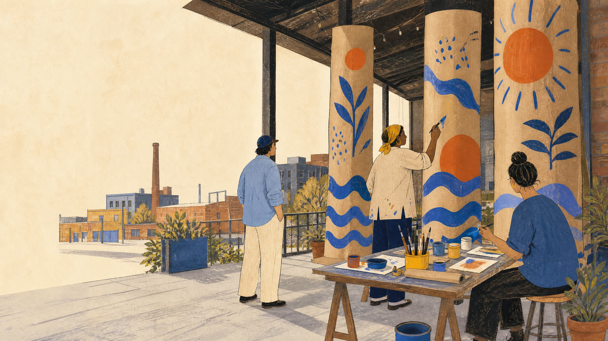
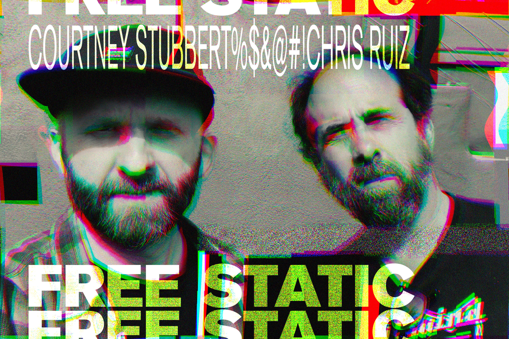
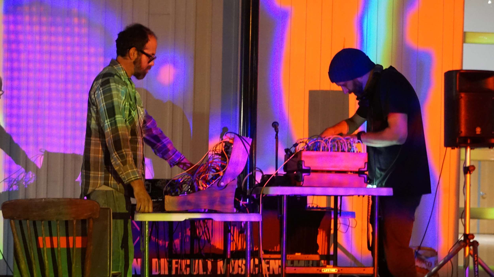

<section class="home-hero" aria-labelledby="home-title">
  <figure class="home-hero-art">
    
    <figcaption class="home-hero-disclaimer">AI-generated concept image — we'll swap this for real event photos once we have them. <a href="AI%20Disclaimer.html">More on how we use AI images</a>.</figcaption>
  </figure>
  

    
Eugene, Oregon · Open to the street

    <h1 id="home-title">A porch for art, ideas, and anyone who walks up.</h1>
    
The Painted Porch is a public-facing community space where people can gather, build, paint, and share what they are thinking about.

    

      <a class="home-button home-button-primary" href="Columns/Assembly%20Instructions.html">See the build guide</a>
      <a class="home-button" href="#visit">Visit at Art Hop · Sept 5</a>
    

  

</section>

<section class="home-section home-visit" id="visit" aria-labelledby="visit-heading">
  <h2 id="visit-heading" class="home-visit-heading">Visit at Art Hop · Sept 5</h2>
  

    <dl class="home-visit-facts">
      
<dt>What</dt><dd>Painting and discussions</dd>

      
<dt>When</dt><dd>Sept 5, 11 AM – 3 PM, during Art Hop</dd>

      
<dt>Where</dt><dd>Westish Shop, 1009 S Bertelsen Rd, Unit E, Eugene, OR 97402</dd>

    </dl>
    
Featuring headliner <a href="https://freestatic.bandcamp.com/album/sharks-lung-in-plastic">Free Static</a>.

    <figure class="home-visit-band" aria-label="Free Static">
      
      
      <figcaption>Free Static, live</figcaption>
    </figure>
  

  

    

      <a class="home-button home-button-primary" href="https://www.warehousedistrictarthop.com/">Art Hop website</a>
      <a class="home-button" href="https://www.instagram.com/warehousedistrictarthop/">Follow Art Hop on Instagram</a>
    

    <figure class="home-map-figure">
      
      <figcaption>Westish Shop, Unit E, is west of Amazon Creek, just north of W 11th Avenue. The creek crosses the map edge to edge; Euphoria is on Stewart Road and the field is east of Bertelsen.</figcaption>
    </figure>
  

</section>

<section class="home-section" aria-labelledby="make-heading">
  

    

      
Start here

      <h2 id="make-heading">Paint with us</h2>
    

  

  

    
Walk up and join in — no painting experience required. The columns are a shared canvas, and pulling up a chair to talk counts just as much as picking up a brush.

    
Have a concept you want to bring to life? Come early and claim a column to make your own.

    
One house rule: once a column is claimed and underway, it's that painter's to finish. Please don't paint over someone else's work in progress.

  

  

    <a class="home-button home-button-primary" href="Columns/Assembly%20Instructions.html">Open assembly instructions</a>
  

</section>

<section class="home-story" aria-labelledby="story-heading">
  

    
Why “Painted Porch”

    <h2 id="story-heading">An old idea, newly opened</h2>
  

  

    
The name comes from the <em>Stoa Poikile</em>, the “Painted Porch” of ancient Athens: a public colonnade where paintings, conversation, and ideas met people passing through. Its openness matters here more than its history.

    
This porch takes that same cue. Art and ideas do not need an invitation to be worth encountering; they can meet us out on the street, unfinished and in progress.

    
The Painted Porch is part of the <a href="https://www.warehousedistrictarthop.com/">Warehouse District Art Hop</a>, Eugene’s monthly celebration of west-side warehouse-district artists and creative spaces.

    
This site and the column project plans are open source on <a href="https://github.com/OpenEugene/PaintedPorch">GitHub</a>.

  

</section>

